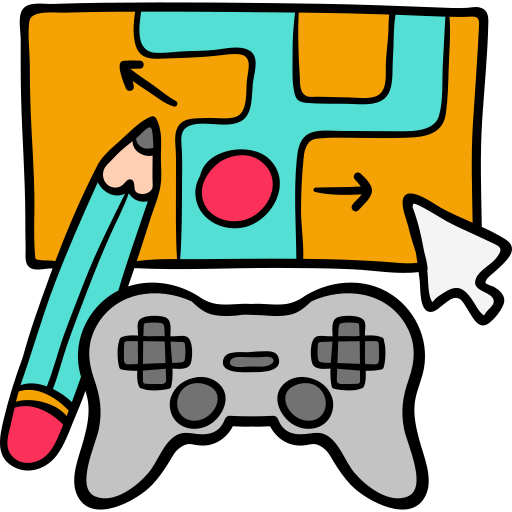

  

We'll spend the rest of the semester discussing the process of developing interactive games; both by building our own, and playing a real-world title.

Developing a game may seem like an impossible task, but it's not. Game development is more approachable than it ever has been, particularly because it has become easier and easier to communicate with computers through intermediary programs, like game engines. A perfect culmination of interaction and user experience design, games are the ultimate in interactive entertainment.

_Please note:_ There is only **one** Lab for this module, which you will work on over these four topics:

<!--

  

    

    
      <i class="fas fa-certificate"></i>
      Coming Soon!
    
    

  

  

    Sorry, we're not ready to move on yet.
  

-->
