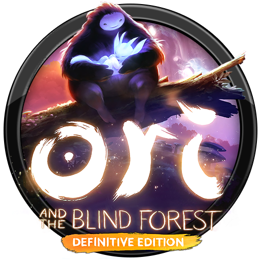
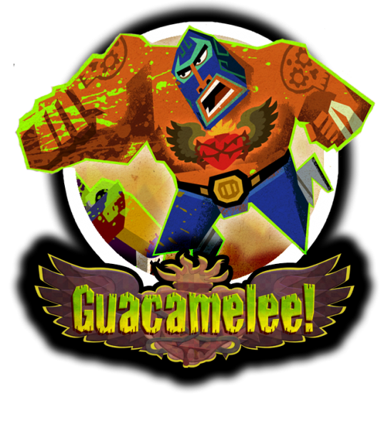
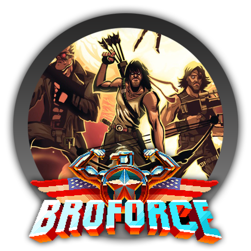
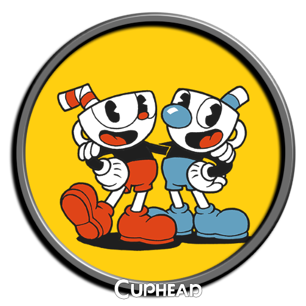

<!--

  

    

    
      <i class="fas fa-certificate"></i>
      Coming Soon!
    
    

  

  

    Sorry, we're not ready to move on yet.
  

-->

<menu id="sticky-navigation" class="sticky">
  <ul class="games">
    <a href="#top" class="scroll"><i class="fas fa-map-marker-alt nav-marker"></i></a>
    <li><a href="#section1" class="scroll">/ Explore</a></li>
    <li><a href="#section2" class="scroll">/ View</a></li>
    <li><a href="#section3" class="scroll">/ Lab</a></li>
    <li><a href="#section4" class="scroll">/ Project</a></li>
  </ul>
</menu>

As you get through our next and final lab, it'll become clearer how games are _interactive experiences_ and the newest media that utilizes creative communication to tell stories between creater, user, and device.

Games have come a long way in a very short time, and are still learning how to use IxD and UxD practices to create working environments that immerse players in artifical worlds. Over the last handful of "Group Think" forums we'll explore some of the elements of game design that accomplish this, utilizing a game you select from the options below.

  <h3><i class="fas fa-book material-marker"></i> Explore: Games, Genres, and the Unity Engine</h3>

Since we'll be discussing the "language of games," it's only fair we become aquainted with some of its terminology.

#### What is a Game?

<iframe width="560" height="315" src="https://www.youtube.com/embed/QPqR2wOs8WI?rel=0&amp;showinfo=0" frameborder="0" allow="autoplay; encrypted-media" allowfullscreen></iframe>

#### What is a Game Engine?

A **game engine** is basically a software development kit on which to build games. Games can be built without using a engine, but having access to pre-developed toolkits, libraries, and scripts can greatly ease and speed-up the creation process. Consider travelling from Point A to Poit B. You can get there by walking, but it's faster and more efficient to drive - although more costly.

#### What is a Game Genre?

Just like with film and literature, video games are categorized by **genre**. Unlike film and literature genres, however, game genres detail a game's type of challenge, rather than its contents. There are umbrella genres like "action" and specific sub-genres, like "shooter" or "survival."

For example, you can have fantasy, adventure, or role-playing games that have completely different goals, but can all be categorized as platformers. A **platformer** (either 2D or 3D) is, at its core, a game where players must jump over suspended platforms or obstacles to complete challenges.

Many early video games were platformers, such as _Super Mario Bros._ (1985) and _Sonic the Hedgehog_ (1991). This genre has made a large resurgance since game engines have become widely available, due to its lower-learning curve and tried-and-true mechanics.

  

  
<b>Blocks</b> are foundational in the <cite>Mario</cite> series, which can be used as platforms to traverse the area, or destroyed for potential benefits or points.

Since you're building a platformer in Unity, you should take some time to see what this engine (and this genre) is capable of, and what [professionals are making](https://unity3d.com/showcase/gallery/?platform=&genre=917&gametype=t-2d#gamesstart)! Please select **one** of the games below, and play it over the course of the _Games_ module. You will be expected to share your expoloration of design through playing this game in your upcoming "Group Think" discussions.

**NOTE:** You can purchase these games for any device or platform, from any service. Steam is just a suggestion (for Mac and PC users without consoles).

\* Denotes game was built using the Unity engine.

#### Platformer Sub-Grene: Metroidvania

The **Metroidvania** sub-genre includes 2D platformers which follow the design structure pioneered by the  _Metroid_ and _Castlevania_ titles.

Video games in this model have an emphasis on exploratory structure, but access to parts of the world is often limited by doors or other obstacles that can only be passed once the player has acquired special items, tools, weapons or abilities within the game.

<table style="width:100%;">
  <tr>
    <td style="width: 30%;">
      
    </td>
    <td style="width: 70%;">
      <b>Choice A:</b> <i>Ori and the Blind Forest</i>(Def. Ed., 2016) 
      <b>Platform:</b> PC, Xbox 
      <b>Access:</b> <a href="http://store.steampowered.com/app/387290/Ori_and_the_Blind_Forest_Definitive_Edition/">Steam</a>, $19.99 
      <b>Approx. Playtime:</b> 10 hrs 
      <b>Recommended for:</b> Those looking for a more artistic, dramatic, and narrative experience.
      <a href="https://www.youtube.com/watch?v=yZOqrskZ6lI" target="_blank">Watch Review</a>
    </td>
  </tr>
  <tr>
    <td style="width: 30%;">
      
    </td>
    <td style="width: 70%;">
      <b>Choice B:</b> <i>Guacamelee!</i> (Gold Ed., 2013) 
      <b>Platform:</b> PC, Mac, PlayStation, Wii U 
      <b>Access:</b> <a href="http://store.steampowered.com/app/214770/Guacamelee_Gold_Edition/">Steam</a>, $14.99 
      <b>Approx. Playtime:</b> 9 hrs 
      <b>Recommended for:</b> Those who enjoy bright, humorous games just on this side of ridiculous.
      <a href="https://www.youtube.com/watch?v=pRbzxY_4tjQ" target="_blank">Watch Review</a>
    </td>
  </tr>
</table>

#### Platformer Sub-Genre: Run 'n' Gun
The **run-and-gun** (or run 'n' gun) sub-genre includes video games in which the player generally controls a lone gunman as they travel on foot through levels defeating enemies.

Run-and-gun games are often defined as a mix between platformers and shoot 'em ups, are generally side-scrollers, and are notable for often featuring enjoyable co-operative gameplay.

<table style="width:100%;">
  <tr>
    <td style="width: 30%;">
      
    </td>
    <td style="width: 70%;">
      <b>Choice C:</b> <i>Broforce</i> (2015)* 
      <b>Platform:</b> PC, Mac, PlayStation 
      <b>Access:</b> <a href="http://store.steampowered.com/app/274190/Broforce/">Steam</a>, $14.99 
      <b>Approx. Playtime:</b> 8 hrs 
      <b>Recommended for:</b> Lovers of '80s and '90s action films, musk, swearing, and gratutious destruction.
      <a href="https://www.youtube.com/watch?v=bEe6fZ1_P9Y" target="_blank">Watch Review</a>
    </td>
  </tr>
  <tr>
    <td style="width: 30%;">
      
    </td>
    <td style="width: 70%;">
      <b>Choice D:</b>  <i>Cuphead</i> (2017)*
      <b>Platform:</b> PC, Xbox 
      <b>Access:</b> <a href="http://store.steampowered.com/app/268910/Cuphead/">Steam</a>, $19.99 
      <b>Approx. Playtime:</b> 11 hrs 
      <b>Recommended for:</b> Those who enjoy classic cartoons - with a dark twist - and aren't afraid of a challenge.
      <a href="https://www.youtube.com/watch?v=cBoPbdOaw7M" target="_blank">Watch Review</a>
    </td>
  </tr>
</table>

<h3><i class="fas fa-video material-marker" style="margin-left: 5px;"></i> Viewing: <i>The Lanugage of Games</i>, Part 1: “Nouns”</h3>

<i>Welcome to the games module!</i>

Choose a game from the options listed up above. Using this selection, we're going to discuss "the language of games," while you have the opportunity to apply those concepts (albeit on a much smaller scale) in your own game for Lab 5.

What do I mean by "the language of games?" Well, most media has it's own language. You're most likely familiar with cinema, and how camera angles, character blocking, and even score can be used to present non-verbal concepts like power, fear, or excitement. Games are no different.

For the purpose of our class, we're going to consider four core parts:

- The "nouns" - characters, rules, controls that present the game concepts.
- The "adjectives" - the art and styling that create the tone.
- The "verbs" - mechanics and actions required to play.
- The "adverbs" - how much of the mechanic, and when they're used (gamefeel).

Some of these are stretches, but for the most part, that model will work for this introductory look at games. Let's being with the "nouns:"

<iframe width="560" height="315" src="https://www.youtube.com/embed/Cji2XXJaX9o?rel=0&amp;showinfo=0" frameborder="0" allow="autoplay; encrypted-media" allowfullscreen></iframe>

  <h3><i class="fas fa-flask material-marker"></i> Lab: “The Rantler,” Part 1: Sprites and Characters</h3>

If you haven't already, download the **free** version of the [Unity](https://store.unity.com/download?ref=personal) engine.

Together with Unity, we're going to build a 2D Platformer starring the “Rantler,” a lone character in a fantastical world of **phsyics**, **collectable objects**, and **hazards!**

**NOTE:** Lab 5 spans four weeks. You will only turn in one assignment for this entire lab, at the very end (as your completed game).

Please login to Moodle when you are ready to access lab materials and requirements.

### Interested in Learning More?

We may be small, but we're glad to offer you additional (and excellent) places to go if you're interested in learning more.

#### Introduction to Characters in Unity
More from Missoula's own Seazen Studio!

<iframe width="560" height="315" src="https://www.youtube.com/embed/S2fcJCUxGg4?list=PLGpqh3JS7l9LJMq8BAR0f-0qVYXggEc5z" frameborder="0" allow="autoplay; encrypted-media" allowfullscreen></iframe>

#### Character Scripts
Note that you can download the scripts so you won't have to write any code yourself.

<iframe width="560" height="315" src="https://www.youtube.com/embed/Xnyb2f6Qqzg?rel=0" frameborder="0" allow="autoplay; encrypted-media" allowfullscreen></iframe>

#### Creating Your Own Custom Characters
You can make your own sprite sheets, or find one online. There are countless ones available, including classic game characters like Zelda and Sonic!

<iframe width="560" height="315" src="https://www.youtube.com/embed/ozgN_YEYnKc?list=PLGpqh3JS7l9LJMq8BAR0f-0qVYXggEc5z" frameborder="0" allow="autoplay; encrypted-media" allowfullscreen></iframe>

  <h3><i class="fas fa-paint-brush material-marker"></i> Project: None</h3>

<i>There is no project for this topic.</i>
