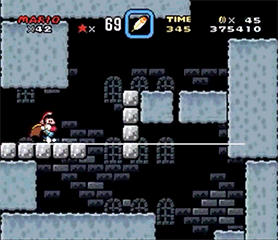

<!--

  

    

    
      <i class="fas fa-certificate"></i>
      Coming Soon!
    
    

  

  

    Sorry, we're not ready to move on yet.
  

-->

<menu id="sticky-navigation" class="sticky">
  <ul class="games">
    <a href="#top" class="scroll"><i class="fas fa-map-marker-alt nav-marker"></i></a>
    <li><a href="#section1" class="scroll">/ Explore</a></li>
    <li><a href="#section2" class="scroll">/ View</a></li>
    <li><a href="#section3" class="scroll">/ Lab</a></li>
    <li><a href="#section4" class="scroll">/ Project</a></li>
  </ul>
</menu>

So, you've begun playing a professinal game, and creating your own. You're thinking in the "langauge of games," and considering the "nouns" of the game (characters, goals, rules). What's next?

This Topic, we'll be capturing the action by attaching a game camera physics forces for our character to interact with, and discussing the mechanics of games.

If that's all Greek to you, don't worry - these are abstract concepts that require exploration to really experience, so roll up your sleeves and jump in!

  <h3><i class="fas fa-book material-marker"></i> Explore: Game Camera and Following Action</h3>

Most platformers, particularly early ones, use a scrolling game camera.

The following is cited from the article "[The Theory and Practice of Cameras in Side-Scrollers](https://www.gamasutra.com/blogs/ItayKeren/20150511/243083/Scroll_Back_The_Theory_and_Practice_of_Cameras_in_SideScrollers.php)." It deals with the scrolling camera view, but there are many different [views and perspecitves](https://www.gamasutra.com/blogs/AnjinAnhut/20110410/89304/A_Look_inside__Evaluating_Camera_Angles_For_Immersion.php) used in game design.

#### Scrolling
"**Scrolling** or Panning refers to any attempt to display a scene that is larger than what fits in a single screen. There are many potential challenges with scrolling, like choosing what the player needs to see, what we as designers would like the player to focus on, and how to do it in a way that’s fluid and comfortable for the player."

#### Attention, Interaction, and Comfort

  
  <ul>
    <li>"<i>Attention:</i> Use the camera to provide sufficient game info and feedback (what the player needs to see);</li>
    <li><i>Interaction:</i> Provide clear player control on what’s displayed, make background changes predictable and tightly bound to controls (what the player wants to see);</li>
    <li><i>Comfort:</i> Ease and contextualize background changes (how to reconcile those needs smoothly and comfortably)."</li>
  </ul>

#### In Practice: _Mario's_ Camera Motion Through the Ages
Side scrollers can have many different tracking tricks. "Keep attention on your control subject." This is usually the main character, but not always solely, as you'll see with _Mario_.

  
  <h5 style="margin-top: 0;"><i>Mario Bros.</i> (1983)</h5>
  
<b>Camera Shake:</b> an example of disconnection between the camera and the controls, as achieved by a camera/screen shake, which provides a sense of drama to the action.

  
  <h5 style="margin-top: 0;"><i>Super Mario Bros.</i> (1985)</h5>
  
<b>Speedup-Push-Zone:</b> when inside the push-zone, gradually accelerate the camera to catch up with player’s speed.

  
  <h5 style="margin-top: 0;"><i>Super Mario World</i> (1990)</h5>
  
<b>Platform-Snapping:</b> adding environment, the camera snaps to the player only as it lands on a platform.

  

  
<b>Camera-Window:</b> push camera position as the player hits the window edge

  
<b>Region-Based-Anchors:</b> different regions (even within levels) set different anchors for position and focus

  
<b>Dual-Forward-Focus:</b> player direction changes switch camera focus to enable wide forward view

  
<b>Manual-Control:</b> controller provides extra panning (horizontally).

<iframe width="560" height="315" src="https://www.youtube.com/embed/TCIMPYM0AQg?rel=0&amp;" frameborder="0" allow="autoplay; encrypted-media" allowfullscreen></iframe>

  <h3><i class="fas fa-video material-marker" style="margin-left: 5px;"></i> Viewing: The Age of Interaction - the iPhone and Beyond</h3>

The world

  <h3><i class="fas fa-flask material-marker"></i> Lab: Xd and Designing</h3>

trdt
 

Please login to Moodle when you are ready to access lab materials and requirements.

  <h3><i class="fas fa-paint-brush material-marker"></i> Project: None</h3>

<i>There is no project for this topic.</i>
