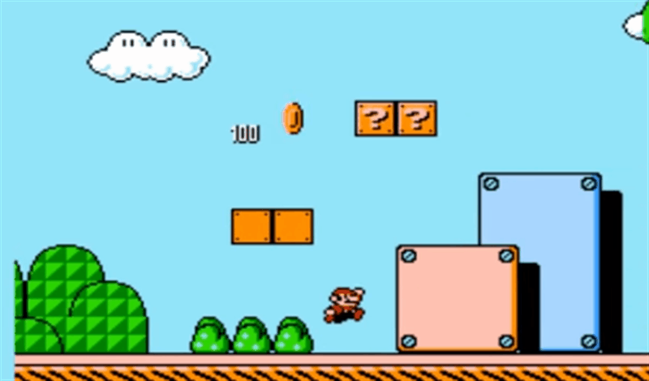

<!--

  

    

    
      <i class="fas fa-certificate"></i>
      Coming Soon!
    
    

  

  

    Sorry, we're not ready to move on yet.
  

-->

<menu id="sticky-navigation" class="sticky">
  <ul class="games">
    <a href="#top" class="scroll"><i class="fas fa-map-marker-alt nav-marker"></i></a>
    <li><a href="#section1" class="scroll">/ Explore</a></li>
    <li><a href="#section2" class="scroll">/ View</a></li>
    <li><a href="#section3" class="scroll">/ Lab</a></li>
    <li><a href="#section4" class="scroll">/ Project</a></li>
  </ul>
</menu>

The background. Not always the most notable when done well, but horribly obvious when done wrong. And it's not the only element of game design whose's subtlety is often overlooked. You'll realize as you start working with physics just how important even the smallest details can be.

Art and sound work together to create sensory environments, and physics dictate how realistic those environment are; from the most lifelike virtual worlds to the highly fantastical platformers.

With thousands of free resources available to learn these elements of game design, you are literally limited only by your imagination.

  <h3><i class="fas fa-book material-marker"></i> Explore: The World of the Game</h3>

Game environments are made up of hundreds of components, many of which you've already encounted (such as characters, objects, and rules). But the <i>actions</i> and dynamics of play are also a large part of how the game functions. We can break these up into two main areas: the "**mechanics**" (esentially what we can do in the game) and the "**forces**" (how physics define how these actions can be performed).

#### Mechanics
Game **mechanics** is an abstract concept used to describe the core fundamentals of the game's design. Most easily defined, mechanics are the "verbs" of the game; the things you _do_, like jumping, shooting, or puzzle-solving (and all the associated tasks).

But this is a very simplistic way of looking at mechanics, and doesn't necessarily account for the weight attached to the _use_ of these verbs. For example, consider the jumps made by the player in the animation below:

You may be tempted to say, “well, Mario jumps to move,” but this is incredibly limiting to both what this mechanic _is_, and _how_ it's being used. Let's consider the jumps in order:

1. The player jumps to **avoid** _taking damage._
2. As a consequence, the jump **positions** him on a _higher platform._
3. The player jumps vertically to **break** a block and _release_ a power-up.
4. The player jumps vertically and switches direction to **collect** the power-up, _instead_ of taking the extra time to jump to the higher platform, switch directions, and collect the power-up as it falls.

A lot more strategy is applied than simply "jumping to jump," yes? The fact that this decision-making goes unoticed by the player is what makes _Mario's_ jump one of the greatest game mechanics ever created.

Another way of thinking about mechanics are as tools players must use to construct the game experience. It is how we use the jump mechanic that defines it.

#### Physics
Continuing our example of jumping, many games play with physics and how certain factors effect the jump and its use. In _Mario_, if you take a running start, your jump will be both higher and longer, with a faster frame rate on the fall.

You're working with joints in your Unity game, but physics most likely effect _everything_ in your game. Simply consider gravity, which has to be programmed into every game.

<iframe src="https://player.vimeo.com/video/17987152?color=f5a205&byline=0&portrait=0" width="640" height="360" frameborder="0" webkitallowfullscreen mozallowfullscreen allowfullscreen></iframe>

<h3><i class="fas fa-video material-marker" style="margin-left: 5px;"></i> Viewing: <i>The Lanugage of Games</i>, Part 3: “Verbs”</h3>

Let's continue the discussion with a game's "verbs!"

#### Verbs

Mechanics (the "How You Push") and Forces (the "What Pushes Back") of the Game

<iframe width="560" height="315" src="https://www.youtube.com/embed/G9Lbww5rGJk?rel=0" frameborder="0" allow="autoplay; encrypted-media" allowfullscreen></iframe>

#### Spotlight: <cite>“Cuphead”</cite>

  <h3><i class="fas fa-flask material-marker"></i> Lab: “The Rantler,” Part 3:  Backgrounds and Physics</h3>

<b>Part 3</b> gets you adding tiled backgrounds and experimenting with physics, as well as adding some audio to your production.

Please login to Moodle when you are ready to access lab materials and requirements.

### Interested in Learning More?

We may be small, but we're glad to offer you additional (and excellent) places to go if you're interested in learning more.

#### Backgrounds
More from Missoula's own Seazen Studio!

<iframe width="560" height="315" src="https://www.youtube.com/embed/uB8yTtmRiRg?list=PLGpqh3JS7l9LJMq8BAR0f-0qVYXggEc5z&v=uB8yTtmRiRg" frameborder="0" allowfullscreen></iframe>

#### 2D Scrolling Backgrounds
Unity live training session on scrolling 2D backgrounds.

<iframe width="560" height="315" src="https://www.youtube.com/embed/GtNW9uD94uc?rel=0" frameborder="0" allowfullscreen></iframe>

#### 2D Physics: Area Effector 2D
In this lesson you can explore the Area Effector 2D component which allows you to add 2D physics forces to objects which enter a trigger volume.

<iframe width="560" height="315" src="https://www.youtube.com/embed/hgUqhsAzGWs?rel=0" frameborder="0" allowfullscreen></iframe>

#### 2D Physics: Distance Joint 2D
The Distance Joint 2D allows a sprite controlled by 2D Physics to rotate around a point, but maintain a certain distance from that point.

<iframe width="560" height="315" src="https://www.youtube.com/embed/wpd2W3bIwx4?rel=0" frameborder="0" allowfullscreen></iframe>

#### 2D Physics: Slinding & Bouncing
Sliding and Bouncing are all controlled by a Physics Material applied to a Collider Component. In this video they set up both Bouncy and Slippery 2D Physics Materials, and apply them to GameObjects.

<iframe width="560" height="315" src="https://www.youtube.com/embed/23HEMKfMKKk?rel=0" frameborder="0" allowfullscreen></iframe>

#### Audio, Collectables, Slider Joint 2D
More from Missoula's own Seazen Studio!

<iframe width="560" height="315" src="https://www.youtube.com/embed/xvza3IaSN2s?list=PLGpqh3JS7l9LJMq8BAR0f-0qVYXggEc5z&v=xvza3IaSN2s" frameborder="0" allowfullscreen></iframe>

  <h3><i class="fas fa-paint-brush material-marker"></i> Project: None</h3>

<i>There is no project for this topic.</i>
