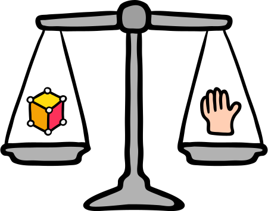

<!--

  

    

    
      <i class="fas fa-certificate"></i>
      Coming Soon!
    
    

  

  

    Sorry, we're not ready to move on yet.
  

-->

<menu id="sticky-navigation" class="sticky">
  <ul class="games">
    <a href="#top" class="scroll"><i class="fas fa-map-marker-alt nav-marker"></i></a>
    <li><a href="#section1" class="scroll">/ Explore</a></li>
    <li><a href="#section2" class="scroll">/ View</a></li>
    <li><a href="#section3" class="scroll">/ Lab</a></li>
    <li><a href="#section4" class="scroll">/ Project</a></li>
  </ul>
</menu>

Games have limitless potenial. The technology is constantly evolving, and the audience ever growing. Game development is no longer limited to jumping on the heads of enemies or aligning candy. Today we see complex environments for education, sensory application, and cross-boundary communication, resulting in virtual worlds, interactive storytelling, and worlds more realistic than the one we wake up to.

You may not be at that stage of creation yet, but you're well on your way. As we conclude the class, you should reflect on all you've accomplished:

1. Created two websites frameworks: multi- and single-page, responsive to devices and alternative screens.
2. Learned and applied user experience design concepts like affordances and flow to an app prototype.
3. Combined all three in an interactive game designed and developed in professional software, most likely for the first time.

This is quite impressive, and I hope you have a handful of new tools to take with you into the yonder of digital interactive technologies.

<h3><i class="fas fa-book material-marker"></i> Explore: Atmosphere, Amount, and “Feel”</h3>

We've spent a lot of time in 2D, so how about venturing into 3D worlds, both virtual and real? If we can even tell the difference anymore....

#### Virtual Reality

**Virtual reality** technologies simulate a person's physical presense in a created environment.

You'll notice how I left out "realism" in that definition. One of the aesthetic realities of 21st century digital 3D environments is that they are very quickly becoming indistinguishable from what we consider ‘real’. And to add to the expanding power of these experiences is the developing opportunity to actually navigate through them. Looking at a 2D image of a digitized room is one thing. Walking through it is quite another. And as the evolution of both hardware (Oculus Rift e.g.) and software (Unity platform e.g.) continue to escalate the next few decades hold the promise of truly immersive environments that will begin to redefine our concept of reality.

<iframe width="560" height="315" src="https://www.youtube.com/embed/LtMfrkRqlRs?rel=0&amp;controls=0" frameborder="0" allow="autoplay; encrypted-media" allowfullscreen></iframe>

#### Workflow

These **virtual environments**, be they 2D projections or immersive virtual reality, are created using a variety of tools. Software programs such as Photoshop, Maya, Cinema 4D and ZBrush are integrated with gaming engines such as Unity and Unreal to design and build the final environments that users interact with.

For those who are already versed in artistic techniques such as still image design and motion design using keyframes, the process becomes one of applying those abilities to the animation and programming workflow that includes techniques such as modeling, texturing and scripting. The goal here is not to necessarily master every aspect of the process but to develop an understanding of the capabilities and requirements of each of the components.

For an overview of the workflow components see Digital Tutor's [Game Development Terms](https://www.pluralsight.com/blog/film-games/demystifying-game-development-terms-your-guide-to-understanding-industry-terms-and-working-like-a-pro).

#### Unity VR Introduction
Unity has introduced built-in support for certain **VR devices**, notably the Oculus Rift Development Kit 2 (DK2) and the consumer edition of the Gear VR (a mobile headset which requires a Samsung Galaxy S6, S6 Edge, S6 Edge+, or Note 5 handset).

Other VR Head Mounted Displays (HMDs) will also work with Unity, such as the HTC Vive, and documentation will be updated in future to cover additional VR platforms.

<iframe width="560" height="315" src="https://www.youtube.com/embed/M6OZvfiEOQg?rel=0" frameborder="0" allow="autoplay; encrypted-media" allowfullscreen></iframe>

<h3><i class="fas fa-video material-marker" style="margin-left: 5px;"></i> Viewing: <i>The Lanugage of Games</i>, Part 4: “Adverbs”</h3>

Let's continue the discussion with a game's "adverbs!"

#### Adverbs

The "How Much?" of a Mechanic, and Contributing to "Gamefeel"

<iframe width="560" height="315" src="https://www.youtube.com/embed/216_5nu4aVQ?rel=0" frameborder="0" allow="autoplay; encrypted-media" allowfullscreen></iframe>

#### Spotlight: <cite>“Broforce”</cite>

  <h3><i class="fas fa-flask material-marker"></i> Lab: “The Rantler,” Part 4:  Game Over!</h3>

<b>Part 4</b> wraps up our tutorial by adding an additional level to your awesome game, and showing you how to package it to play.

Please login to Moodle when you are ready to access lab materials and requirements.

### Interested in Learning More?

We may be small, but we're glad to offer you additional (and excellent) places to go if you're interested in learning more.

#### A Closer Look at Adding Scenes
More from Missoula's own Seazen Studio!

<iframe width="560" height="315" src="https://www.youtube.com/embed/sGIN3sWT9Pc?list=PLGpqh3JS7l9LJMq8BAR0f-0qVYXggEc5z&v=sGIN3sWT9Pc" frameborder="0" allowfullscreen></iframe>

  <h3><i class="fas fa-paint-brush material-marker"></i> Project: None</h3>

<i>There is no project for this topic.</i>
