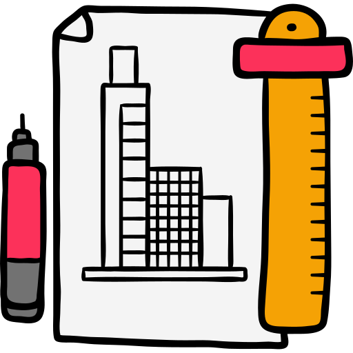
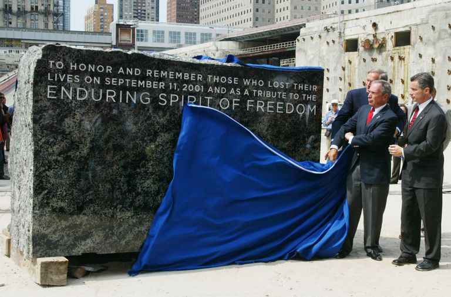
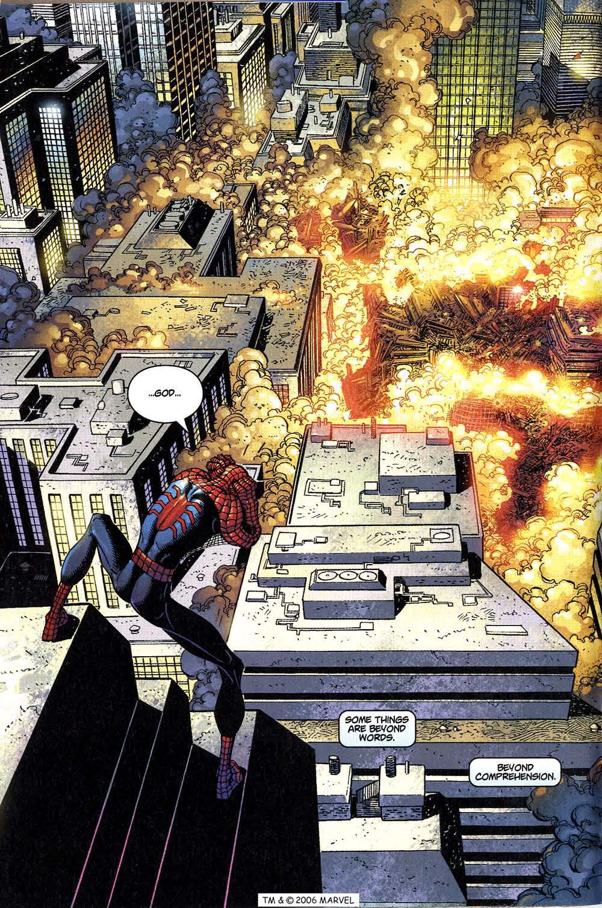

<!--

  

    

    
      <i class="fas fa-certificate"></i>
      Coming Soon!
    
    

  

  

    Sorry, we're not ready to move on yet.
  

-->

<menu id="sticky-navigation" class="sticky">
  <ul class="ixd">
    <a href="#top" class="scroll"><i class="fas fa-map-marker-alt nav-marker"></i></a>
    <li><a href="#section1" class="scroll">/ Explore</a></li>
    <li><a href="#section2" class="scroll">/ View</a></li>
    <li><a href="#section3" class="scroll">/ Lab</a></li>
    <li><a href="#section4" class="scroll">/ Project</a></li>
  </ul>
</menu>

It may seem strange to discuss architecture in a Digital Media course, but this practice is incredibly influential on our everyday perspectives, artistic or not.

We will begin this Topic looking at architecture in the traditional sense, move into integration of technology and physical construction, and conclude with the purely digital infrastructure of websites.

To begin, let's briefly continue our exploration of "design spacial awareness," transitioning from objects to environments. Have you considered how the space around you influences your personal atmosphere? Provides inspiration? Responds to your physiological, psychological, or cultural needs?

This may seem like a nonsensical thing to think about, but this is an integral design consideration for many contemporary architects. Architecture is transitioning to the nearly spiritual, _responding_ to events and even _interacting_ with its communities on an enormous scale.

To illustrate, can you think of a site whose structures (past and present) have become so culturally relavent they define a nation?

  <h3><i class="fas fa-book material-marker"></i> Explore: The Design of Space</h3>

#### 2WTC
<blockquote>
  “The World Trade Center is a living symbol of man’s dedication to world peace...a representation of man’s belief in humanity, his need for individual dignity, his beliefs in the cooperation of men, and, through cooperation, his ability to find greatness.” 
  - <i>Architect Minoru Yamasaki, at the opening ceremony for the Twin Towers, 1973</i>
</blockquote>

The cornerstone of 1 World Trade Center, July 4, 2004.

When the Twin Towers of the World Trade Center were destroyed in 2001, it rocked a nation previously thought untouchable to its core. Every form of media reacted to the event, and a people were on hold.

  
  
<a href="https://imgur.com/gallery/83xZp" target="_blank">Spiderman Issue #36</a>, Dec 2001

The American Zeitgeist shifted, and radical changes were made to normal activites like travel, communication, and privacy.

The architects who were brought in to rebuild were burdened with a diffiult task; taking New York's most hallowed site and creating towers that were respectful to the property's history, yet progressive and innovative. The original towers stood for economic power, and the new ones needed to as well; but they also needed to represent abstract concepts like unity, freedom, and community. It seemed an impossible task, and the projects passed between many hands.

The National 9/11 Memorial (_Reflecting Absence_) opened September 11, 2011, and 1 World Trade Center (_Freedom Tower_) followed suit in Novemeber of 2013. Other towers are still in construction, with 2 World Trade Center currently in the hands of architect Bjarke Ingels.

“We have tried to incorporate that duality,” Ingels said. “On one hand it’s about being respectful and about completing the frame around the memorial, and on the other hand it’s about revitalizing downtown Manhattan and making it a lively place to live and work.”

<iframe src="https://h5p.org/h5p/embed/117335" width="800" height="600" frameborder="0" allowfullscreen="allowfullscreen"></iframe>

#### Brick and Mortar:  Traditional Architeture
<blockquote>

“Established in 1875, the Larkin Company was a national mail-order business that sold soap products to middle class consumers. Its managers, including John D. Larkin, Elbert Hubbard, Darwin Martin, and William Heath ascribed to the belief that hard work was a moral imperative, and attempted to foster a familial office culture. The construction of a new headquarters was intended to ensure the highest levels of efficiency, productivity, and cooperation among its employees. The mottoes adorning the structure’s balconies and exterior plaques, written primarily by Heath, reinforced these ideals.

“Built in 1903, the Larken Administration Building's interior and exterior design and furnishings responded to the daily operations of the company and provided for the welfare of its employees—an early form of air conditioning cooled the space while a communal dining facility, classrooms, and lounge area with a fireplace promoted a congenial office culture.”

- <i><a href="http://flwright.org/researchexplore/wrightbuildings/larkincompanyadministrationbuilding">Frank Lloyd Wright Trust</a></i>
</blockquote>

We owe much to the prolific architect Frank Lloyd Wright and his work, including the idea that office spaces could enhance the life of its employees. But what of other spaces?

Architecture has always been slow to adapt to new traditions, but with the rise of the sustainability movement and digital technologies, we're seeing architecture becoming _responsive_ and even _interactive_ to the surrounding environment.

It's critical that we explore the philosophy of architecture - old and new - and how it has the potential to be interactive art on the grandest scale.

#### Process and Effect:  Interactive Architecture

**Interactive architecture** refers to the branch of architecture which deals with buildings featuring the trio of sensors, processors and effectors, embedded as a core part of its nature and functioning. Interactive architecture encompasses building automation but goes beyond it by including forms of interaction engagements and responses that may lay in pure communication purposes as well as in the emotive and artistic realm, thus entering the field of Interactive Art.

There are many different studios specializing in this field. Here are just a few:

##### CiniMod Studios

<a href="http://www.cinimodstudio.com/" target="_blank">http://www.cinimodstudio.com/</a>

A cross-discipline practice based in London, Cinimod Studio specialises in the fusion of architecture and lighting design. With a passion for interactive art and lighting schemes, architect and artist Dominic Harris founded the studio in 2007, which has since produced numerous projects spanning across the international art and architecture landscapes.

<iframe src="https://player.vimeo.com/video/33297778?color=FC315A&title=0&byline=0&portrait=0" width="640" height="360" frameborder="0" webkitallowfullscreen mozallowfullscreen allowfullscreen></iframe>

"Finial Response" is a permanent interactive public artwork in the bustling heart of Soho in London which blurs the boundaries between architecture and art. The artwork covers 20 meters at street level and consists of 109 individually shaped black steel profiles sandwiching illuminated acrylic which responds to the movements of passers-by. Each profile shape echoes ornamental finials found around Westminster, connecting Soho’s decorated past with its new incarnation as a media hub.

##### The Living

<a href="http://www.thelivingnewyork.com/index.html" target="_blank">http://www.thelivingnewyork.com/index.html</a>

The Living, a first-of-its-kind Autodesk Studio, explores the future by building full-scale functioning prototypes today. Their projects apply generative design, biology, and new materials to real-built projects in the context of technology, culture, and the environment. Recently, The Living was ranked third by Fast Company in its list of World’s Most Innovative Companies in Architecture.

<iframe src="https://www.youtube.com/embed/59tILjjK1Oo" width="640" height="360" frameborder="0" webkitallowfullscreen mozallowfullscreen allowfullscreen></iframe>

"HIVE" is an architectural-scale pavilion at Autodesk University 2015 woven together and built through human and robot collaboration. This project forefronts a combination of experimental technologies focused on pushing the boundaries of design and construction, including: tensegrity structures, generative design, robot construction, and interactive wearable computing. Robots (UR-10) were provided by Universal Robotics.

##### The Interactive Architecture Lab

<a href="http://www.interactivearchitecture.org/" target="_blank">http://www.interactivearchitecture.org/</a>

The Interactive Architecture Lab at UCL is interested in the Behaviour and Interaction of Things, Environments and their Inhabitants. The Lab is engaged in a range of academic research activities and industry collaborations. At its heart is the 15-month Masters programme "MArch Design for Performance & Interaction," which gives students an opportunity to exploit the potential of new sensing, computation, networked and responsive technologies to imagine, build and test new spaces of performance & interaction.

<iframe src="https://player.vimeo.com/video/184714610?color=FC315A&title=0&byline=0&portrait=0" width="640" height="360" frameborder="0" webkitallowfullscreen mozallowfullscreen allowfullscreen></iframe>

The "<a href="http://www.interactivearchitecture.org/lab-projects/sarotis" target="_blank">Sarotis Project</a>" presents a two phased study: a series of technical experiments and a speculative film. First an experimental prosthesis was designed to study whether a person’s awareness of space could be amplified using live 3D scanning technologies controlling the inflation and deflation of our soft robotic wearable. Results were successful and suggested possible applications for people with visual impairments. It also revealed the possibility of constructing virtual spaces within physical space that could be sensed through it.

#### Code and Clicks:  Web/Site Architecture

**Web Architecture** focuses on the technologies and principles which sustain the Web, including URIs and HTTP. Its foundations lie in systematic and dependable server-client communication, and involves developing applications through additional fields, including data, storage, and networking. Web architecture is a product of engineers and software developers. _Website_ architecture, however is on us as designers.

**Website "architecture"** relates specifically to websites, and refers to the way websitse are structured to ensure business goals are met while delivering a great experience to users. The overall picture of a website’s architecture includes:

- usability
- interaction design
- user interface design
- information design
- web design
- graphic design
- content strategy ([Max Koh](https://blog.optimalworkshop.com/anatomy-website-website-architecture))

Web designers are responsible for organizing and presenting content in an engaging way. It is their job to to create the interface of the site, including its site map (blueprint), layout (framework), content (structure), and graphics (finishes).

In accomplish this in a feasible way and for the greatest audience possible, web designers follow **web standards** and **best practices**, as described in the video below.

<iframe src="https://player.vimeo.com/video/234957396?color=FC315A&title=0&byline=0&portrait=0" width="640" height="360" frameborder="0" webkitallowfullscreen mozallowfullscreen allowfullscreen></iframe>

  <h3><i class="fas fa-video material-marker"></i> Viewing: <cite>Abstract: The Art of Design</cite>, Episode 04: “Bjarke Ingels on Architecture” (<a href="https://www.netflix.com/title/80057883" target="_blank">NetFlix</a>)</h3>

Bjarke Ingels boasts many talents—as a draftsman, as a salesman, as the charming cultivator of his own winning image—but his greatest asset is a gift for storytelling: an ability to construct a narrative around practical necessities. Often his designs careen in fantastical directions.

<blockquote>
  “Architecture is the art of turning fiction into fact.” 
  - <i>Bjarke Ingels</i>
</blockquote>

He is currently building a waste-to-energy plant in Copenhagen with a slanted roof that will serve as a recreational ski slope and a smokestack that will puff a symbolic ring of steam each time it emits a ton of carbon dioxide. For a proposed expansion of Google’s campus in Mountain View, California, Ingels (along with collaborator Thomas Heatherwick) created a wildly elaborate complex of geodesic domes, envisioning a lifestyle of biking, hiking, and coding inside a sunlit glass terrarium. Such imaginative flights have made Ingels famous—and highly sought-after—at an age considered precocious by architecture standards. (via [Wired](https://www.wired.com/2015/09/bjarke-ingels-2-world-trade-center-wtc-2))

<iframe src="https://player.vimeo.com/video/236979494?color=FC315A&title=0&byline=0&portrait=0" width="640" height="360" frameborder="0" webkitallowfullscreen mozallowfullscreen allowfullscreen></iframe>

  <h3><i class="fas fa-flask material-marker"></i> Lab: Muse and Responsive Web Design </h3>

Unlike traditional architecture, website architecture is fluid and adaptive.

**Responsive Web Design** is the "it" concept in current web design and development. The goal of RWD is to create responsive websites that provide optimal viewing experiences across devices (like desktop computers versus mobile phones).

RWD relies on flexible grid and layout systems to organize content, and creates dynamic changes depending on the screen size and orienation of the device. _RWD is considered an essential practice for designers._

  
Example: The <a href="http://www.morehazards.com">More Hazards More Heroes</a> site combines animation, color, and information in multiple layouts across screen sizes, keeping the most distinctive elements in each and carefully collapsing others to provide engagement while keeping data consumption low for mobile.

<a href="https://www.adobe.com/products/muse.html" target="_blank">Adobe Muse</a> allow users to create and publish professional websites that look great on desktop and mobile browsers, using a free-form canvas and layout tools - all without writing a single line of code.

For our class, we're going to spend a few Topics exploring this software. Muse was particularly created to help designers venture into web content creation without having to be developers (coders). We will be using Muse as a way to explore interative web elements without having to do a code bootcamp.

Please login to Moodle when you are ready to access lab materials and requirements.

  <h3><i class="fas fa-paint-brush material-marker"></i> Project: None</h3>

<i>There is no project for this topic.</i>
