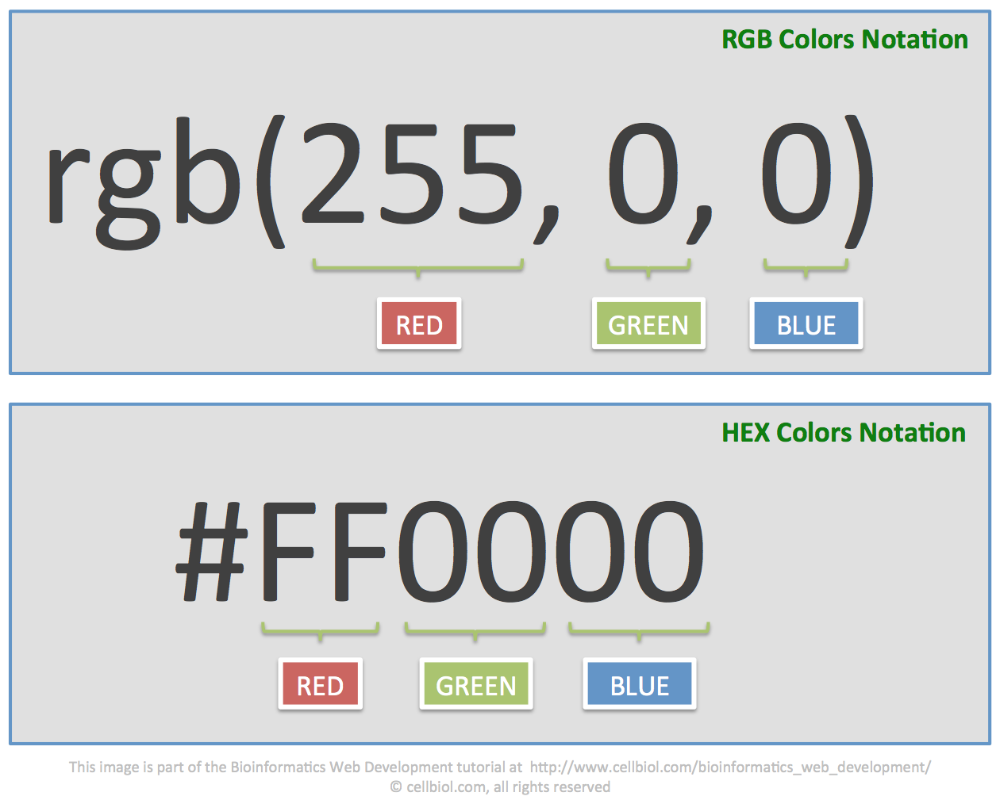

<!--

  

    

    
      <i class="fas fa-certificate"></i>
      Coming Soon!
    
    

  

  

    Sorry, we're not ready to move on yet.
  

-->

<menu id="sticky-navigation" class="sticky">
  <ul class="ixd">
    <a href="#top" class="scroll"><i class="fas fa-map-marker-alt nav-marker"></i></a>
    <li><a href="#section1" class="scroll">/ Explore</a></li>
    <li><a href="#section2" class="scroll">/ View</a></li>
    <li><a href="#section3" class="scroll">/ Lab</a></li>
    <li><a href="#section4" class="scroll">/ Project</a></li>
  </ul>
</menu>

Architecture is largely a practice in permanence - creating structures the enforce abstract concepts, yes, but limited by their needs for solidity and longevity. The majority of constructions are designed to last, be self-sustaining, and are _usually_ unmoving.

But this is not the only field of design that uses statues and structures to create meaning or experiences - far from it. The number one ingredient to any design is **space**; whether it's an artboard, three-column web layout, or walls of an installation, we all begin with space, and the first step in our creative process is deciding what to do with it.

  <h3><i class="fas fa-book material-marker"></i> Explore: The Design of Space</h3>

**Let's start by looking at spaces we _observe_ as viewers.** We can describe these as spaces that exist without our intervention, like art pieces or films. Tried-and-true design tools and methods are used to communicate complex ideas, often without words or dialogue. How? Well, let's talk about a pillar of visual language that many of you are already familiar with: pattern.

  

All design is based in patterns; searching for, finding, constructing, or _deconstructing_. While initially patterns may appear static (unmoving or flat), it's important to remember that pattern is one of the fundamental principles of design. This is also true of <a href="https://www.interaction-design.org/literature/article/repetition-pattern-and-rhythm" target="_blank">IxD</a>, where patterns - along with rhythm and repetition - are used to create meaning, direct attention, and even simulate motion. Unsuprisingly, pattern can be one of the most ingenious ways of indirect storytelling in the media arts.

Production and stage designers know this well. As many of you are filmmakers as well as designers, let's take a quick look at one of the most prolific filmmakers of the 20th century, who used pattern and perspective as his major method of creating atmosphere - Stanley Kubrick.

#### The Psychology of Pattern

Kubrick's spaces were as much characters in his scripts as the actors. This is particularly present in _The Shining_ (1980), whose Overlook Hotel is an impossible maze of rooms, windows, and halls. The Escher-styled design and set anomolies were used to disorientate viewers, and by all accounts, this space could never have existed outside of this fictional stage.

<blockquote>
  “A world away from the dusty, peeling interiors usually seen in horror movies, the hotel interior envisioned by Kubrick is spacious and modern. The set generates tension not through claustrophobia and dark spaces, but with high ceilings and lonely expanses. Characters are frequently dwarfed by gigantic columns or huge windows. Even the carpets accentuate the how small and vulnerable Danny and his mother are; one shot shows the little boy playing on a carpet whose huge geometric patterns surround him like a cage.” 
  - <i><a href="http://www.denofgeek.com/us/movies/18283/iconic-set-design-the-shinings-overlook-hotel" target="_blank">Ryan Lambie</a></i>
</blockquote>

Juli Kearns’ article <a href="http://www.idyllopuspress.com/meanwhile/30410/the-shining-how-the-kubrick-carpet-trick-works" targe="_blank">'How the Kubrick Carpet Trick Works'</a> is a fascinating analysis of why character Danny Torrance's placement on the carpet varries from shot-to-shot, suggesting a metaphorical chess match between the boy and space (in this case, the Hotel itself).

<blockquote>
  “Writer Rob Ager made an exhaustive and brilliant examination of <cite>The Shining’s</cite> set design, and suggested that Kubrick deliberately built anomalies into the hotel’s layout in order to confuse the viewer’s spatial awareness. Kubrick <b>wanted</b> us to know how gigantic and dehumanising this place is – before the psychological wargames begin, he shows us the battleground on which they'll take place. <cite>The Shining</cite> is the perfect example of the use of set design to enhance a narrative. Combined with its cinematography, the viewer is left with the impression of a building that isn’t merely haunted, but alive, and actively observing its occupants’ every move.” 
  - <i><a href="http://www.denofgeek.com/us/movies/18283/iconic-set-design-the-shinings-overlook-hotel" target="_blank">Ryan Lambie</a></i>
</blockquote>

Many other films have payed homage to the Overlook's flooring, in very subtle ways. This is the power of methodic design. <cite>Toy Story</cite> (1995), <cite>Birdman</cite> (2014), and <cite>Minions</cite> (2015)

#### The Power of Perspective

**Next, let's look at spaces we _respond to_ by being present.** These are places that require an audience to perform their core function, like theatre productions, music or athletic venues, or art installations. Their goal is to encourage viewer connection with the presentation through the use of objects in time and space.

  <iframe src="https://player.vimeo.com/video/237151304?color=FC315A&title=0&byline=0&portrait=0" width="640" height="360" frameborder="0" webkitallowfullscreen mozallowfullscreen allowfullscreen></iframe>

In film, the production design and cinematography work together to force the viewer to look at an important part of the screen. This is not interactive, but it <i>does</i> illicit reaction from the audience. Kubrick in particular was a master at using a compostional technique called "one-point perspective" to enhance the atmosphere created by his cinematic spaces.

<blockquote>
  “The composition of these shots draws the viewer's eye to a specific focal point within the frame, absorbing them into the dimension of the shot and manipulating the experience by telling them exactly where to look. It also elicits an emotional response, typically of uneasiness or dread... Even when nothing is happening, putting our focus on a particular point makes us wonder when something will, creating an environment of tension and anticipation.”
  - <i><a href="http://screenprism.com/insights/article/the-filmmakers-handbook-what-is-one-point-perspective" target="_blank">Filmmaker's Handbook</a></i>
</blockquote>

Like architecture, cinema is solid - it has permanence and we can watch a film over and over again. But what happens when we add _time_ to the mixture? Or better yet: multi-point perspectives?

This is something stage designers and installation artists need to consider constantly, because not only are they creating "moments in time" rather than permanent pieces, they often have to be viewable and enjoyable from multiple angles (such as concert venues and [theatre in the round](https://en.wikipedia.org/wiki/Theatre_in_the_round)).

Learning how stage designers apply these practices is critical to understanding how we as digital artsts can creat immersive, psychological experiences that outlast the methods which created them. Remember, graphics are the first thing to go out of style, and they go out _fast._ Solidity needs to be found in experience, not only structure.

  <h3><i class="fas fa-video material-marker" style="margin-left: 5px;"></i> Viewing: <cite>Abstract: The Art of Design</cite>, Episode 03: “Es Devlin on Stage Design” (<a href="https://www.netflix.com/title/80057883" target="_blank">NetFlix</a>)</h3>

Es Devlin is widely considered to be the world’s foremost set designer. She is an architect of temporary space, making images that can survive only in the minds of the people who see her shows.

<blockquote>
  “I do all this work and nothing physical remains...So what I’m really designing are mental structures as opposed to physical ones. Memories are solid, and that’s what I’m trying to build.” 
  - <i>Es Devlin</i>
</blockquote>

In theatre terms, this is the age of Es Devlin. She is theatre’s postmodern expert, and has an instinctive sense of how Shakespeare and opera and fashion and pop concerts might draw from the same dark web of psychological information. Each of her designs is an attack on the notion that a set is merely scenery. She is in demand because she can enter the psychic ether of each production and make it glow with significance. (via [The New Yorker](https://www.newyorker.com/magazine/2016/03/28/es-devlins-stages-for-shakespeare-and-kanye))

<iframe src="https://player.vimeo.com/video/236999292?color=FC315A&title=0&byline=0&portrait=0" width="640" height="360" frameborder="0" webkitallowfullscreen mozallowfullscreen allowfullscreen></iframe>

  <h3><i class="fas fa-flask material-marker"></i> Lab: Muse and Responsive Elements </h3>

Now that you have some experience with frameworks in different views (desktop, tablet, mobile), when need to consider how the elements of sites react

#### Web Fonts
**Generally, a website's stylesheet uses 2-3 fonts at most.**

There are a handful of fonts which are available across all common systems. These fonts like Arial, Courier, and Times New Roman are **web-safe** because they are guaranteed to render for most viewers.

Plain **Web fonts**, in contrast, are fonts hosted from servers and linked inside the site intself, and are not called up by a device's operating system. [Adobe Typekit](https://typekit.com/), [Google Fonts](https://fonts.google.com/), and [FontSquirrel](https://www.fontsquirrel.com/) are common font repositories.

Designers will often link to a primary web font and a fallback web-safe font, should the primary not render as expected.

  
Example: Dutch site <a href="https://www.evert45.com/">Evert_45</a> is a web experience about a young boy living through 1945, who uses modern services like Instagram and YouTube to share his story.

  
“For the website we also wanted to share the whole story in one timeline for a broader audience. <a href="https://www.myfonts.com/fonts/bitstream/atf-bodoni/">Bodoni</a>, a historical font, was the right choice. And the contrast between the big round numbers with the small caps creates a beautiful historical feeling.

  
“To connect to the Instagram and YouTube content, we used large typography guided by a voiceover at the start of each chapter, to create a seamless online story. And it all seems to be working. We reached an incredible 50 per cent of Dutch teens within two weeks.”

#### Color
**Gerenally, a website's style uses 3-6 colors at most.**

In web design, color is used for many reasons beyond mere branding. Color directs attention, provides personality, and establishes cohesion and flow.

  

Although you are not coding in this class, you should know that designers reference colors in 3 ways:
- Color name, `<style="color: red">`
- Decimal RGB, `<style="color: rgb(255,0,0)">`
- Hexadecimal RGB (hex), `<style="color: #FF0000">`

While hex is the primary way to state value on the web, RGB and color names are still widely-used for various reasons.

<iframe src="https://player.vimeo.com/video/236982237?color=FC315A&title=0&byline=0&portrait=0" width="640" height="360" frameborder="0" webkitallowfullscreen mozallowfullscreen allowfullscreen></iframe>

[Adobe Color](https://color.adobe.com/create/color-wheel), [Paletton](paletton.com), [ColourCode](http://www.colourco.de/), and [Material Design](https://material.io/color) from the video below are all excellent ways of teasing out a color palette. Material Design even offers a color accessibility checker.

  
Example: See how <a href="http://innovationprojectcanvas.com/">Innovation Project Canvas</a> uses a single color to create engaging linear flow.

Please login to Moodle when you are ready to access lab materials and requirements.

  <h3><i class="fas fa-paint-brush material-marker"></i> Project: None</h3>

<i>There is no project for this topic.</i>
