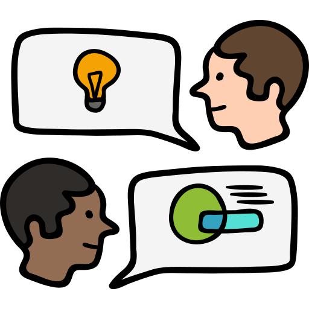

<menu id="sticky-navigation" class="sticky">
  <ul class="pd">
    <a href="#top" class="scroll"><i class="fas fa-map-marker-alt nav-marker"></i></a>
    <li><a href="#section1" class="scroll">/ Explore</a></li>
    <li><a href="#section2" class="scroll">/ Viewing</a></li>
    <li><a href="#section3" class="scroll">/ Lab</a></li>
  </ul>
</menu>

## Let's Begin: Finding the Principle of the Matter

This course is designed to help students gain the skill sets necessary to successfully create work in the constantly evolving digital environment. It covers the fundamentals of interactive website elements, prototyping, and game development, with a focus on evaluating user testing and addressing user challenges in these media. Our journey covers a lot in very little time, studying the principles of interactive experiences and the group processes that make them successful.

### Assessment

This course will use two main resources for you to complete your homework.

#### Homework

Homework is divided into four activity types:

1. _“Group Think” Forums_ - Discussions regarding the materials found on this website.
2. _Labs_ - Small exercises or responses to writing prompts.
3. _Topic Projects & Workshops_ - 3 creative projects which ask you to expand on a lab in your own, creative way.
4. _Final Project & Workshop_ - A multi-part project of your choosing from our 3 core fields (web site, app prototype, or game clone).

#### Moodle

Moodle will contain all your assignments for the semester. You will use it to access “Group Think” forums, labs, and Workshops. It will also be where grades are recorded, and where you can communicate with your Instructor and TA.

#### Course Website

This website is the main repository for your learning materials. While there may be additional questions or prompts posted on Moodle, the majority materials you’ll encounter will be through this website.

Above you should see a gray navigation bar which breaks up these pages into three main areas: "explore," "viewing," and "lab." You can use this navbar to move about the page at any time.

  <h3><i class="fas fa-book material-marker"></i> Explore...</h3>

The "exploration" section of each topic contains the majority of the learning materials. These are readings, writings, videos, and presentations. This area will introduce the main content, and feed into the Lab.

"Group Think" forums will ask your opinions or experiences with this material, so please _explore_ and enjoy!

  <h3><i class="fas fa-video material-marker"></i> Viewing...</h3>

You'll also use "viewings" to formulate your "Group Think" responses!

Each week we will view a short or full film, generally around an hour long. You will need access to NetFlix to view several episodes of _Abstract_, which steps inside the minds of the most innovative designers in a variety of disciplines to learn how design impacts every aspect of life.

Meet [Don Norman](https://www.jnd.org/), a man we'll discuss over the IXD and UXD modules. Can you relate to his way of viewing design?

<h3><em>The 3 Ways Good Design Makes You Happy</em>, feat. Don Norman (2003)</h3>

<iframe width="560" height="315" src="https://www.youtube.com/embed/RlQEoJaLQRA?rel=0&amp;showinfo=0" frameborder="0" allow="autoplay; encrypted-media" allowfullscreen></iframe>

  <h3><i class="fas fa-flask material-marker"></i> Lab... </h3>

**Labs** are usually step-by-step guides to teach you the creative technologies used in the course. These include Adobe [XD](https://www.adobe.com/products/xd.html) and [Muse](https://www.adobe.com/products/muse.html), and [Unity](https://store.unity.com/products/unity-personal).

Each topic you'll have a lab and respective tutorial. You will turn in functioning clones of the projects discussed. In exchange, you'll have the opportunity to explore the software further during Projects.

A **Project** will ask you to add to a past lab in your own way. For example:

<blockquote>

For your web Project, create <b>two additional site pages</b> to sell the product, focusing on usability and branding. Some inclusions to consider:

<ul>
  <li>Pre-order or purchasing form</li>
  <li>Customer reviews or comments</li>
  <li>Further product specs or customization</li>
  <li>Other pages gleaned from your own research</li>
</ul>

Your pages should fit within the brand of the site (colors, patterns, typography), be easily accessible, and enhance the integrity of the product.

</blockquote>

We will workshop these Projects as a class. Whereas labs will ask you to complete the tutorial as exactly as possible, Projects and their Workshops are more about _trials_.

Your submissions should be as complete as possible for the class timeline, but the goal of usability testing is to have outsiders evaluate the product while in development. You'll use your classmate's experiences with your alpha test to implement changes and fixes to your Workshop submission before sending it to your instructor for evaluation.

You'll write about your reviews and any solutions you implemented based on these findings in a short write-up at the end of the module.

<iframe width="560" height="315" src="https://www.youtube.com/embed/48dMCEDJ1gM?rel=0" frameborder="0" allow="autoplay; encrypted-media" allowfullscreen></iframe>
