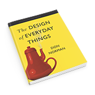

<!--

  

    

    
      <i class="fas fa-certificate"></i>
      Coming Soon!
    
    

  

  

    Sorry, we're not ready to move on yet.
  

-->

<menu id="sticky-navigation" class="sticky">
  <ul class="uxd">
    <a href="#top" class="scroll"><i class="fas fa-map-marker-alt nav-marker"></i></a>
    <li><a href="#section1" class="scroll">/ Explore</a></li>
    <li><a href="#section2" class="scroll">/ View</a></li>
    <li><a href="#section3" class="scroll">/ Lab</a></li>
    <li><a href="#section4" class="scroll">/ Project</a></li>
  </ul>
</menu>

Before televisions and computers were affordable, viewing art was expensive. Unless you could travel to museums or exotic locales, most people experienced art through books and pictures. Now, screens have become our primary method of consumption. Digital creative softwares has changed how we build for the outside world, but more importantly, it took art-making away from institutions and brought it into rural communities and homes.

This adventure is still fairly new in the history of human technology, and we're still learning how to properly communicate in design. And even the smallest moments can carry with them great messages, as you'll see with illustrator Christoph Niemann, who explores bridging dimension, physicality, and technology as he progresses through his career.

As patience levels dwindle and attention spans decrease, interfaces need to become intuitive, understandable, and adaptable across boundaries like economic status, education, and language; even the device itself.

  <h3><i class="fas fa-book material-marker"></i> Explore: Aesthetics for the New Age</h3>

As the 21st-century generation of artistic innovators explore untapped territory and create new aesthetic environments and experiences, our aesthetic sensibilities begin to evolve as well.

The expansion of a visual and sonic language engrained in a increasingly networked culture affords us the opportunity to continually reassess the role of creation, participation and meaning and our relationship to it. One example is the "New Aesthetic," a term coined by James Bridle that refers to the increasing appearance of the visual language of digital technology and the Internet in the physical world, and the blending of virtual and physical.

Since we are clearly in an era of convergence it is critical that we maintain a holistic overview of the aesthetic experiences that this new paradigm offers.

<iframe src="https://player.vimeo.com/video/239828561?color=33A3C1&title=0&byline=0&portrait=0" width="640" height="360" frameborder="0" webkitallowfullscreen mozallowfullscreen allowfullscreen></iframe>

#### "What is UXD?"

Generally speaking, users _experience_ digital aesthetics in ways different from the traditional, particularly when approaching websites, apps, and interactive games. These interfaces are expected to respond to a participant, whether that is to deliver information, provide a service, or, in the realm of games, challenge and encourage further feedback and actions.

**User Experience Design,** or UXD (most commonly called UX Design) "is studying user behaviour and understanding user motivations with the goal of designing better digital experiences." This involves design, user testing, and product improvement strategies; it is the field dedicated solely to the user's experience with the product.

UXD is one of those things that you don't realize is working until it _isn't_. Take, for example, the "Norman Door."

<blockquote>
  “A so-called “Norman Door” has design elements that give you the wrong usability signals to the point that special signage is needed to clarify how they work. Without signs, a user is left guessing about whether to push or pull, creating needless frustration.” 
  - <i><a href="https://99percentinvisible.org/article/norman-doors-dont-know-whether-push-pull-blame-design/" target="_blank">Roman Mars</a></i>
</blockquote>

<iframe src="https://player.vimeo.com/video/239821723?color=FC315A&title=0&byline=0&portrait=0" width="640" height="360" frameborder="0" webkitallowfullscreen mozallowfullscreen allowfullscreen></iframe>

 

In other words: _It's not just you. Bad doors are everywhere._

“There is no reason for these backward designs to persist, since various working solutions to the problem already exist, and yet these horrible doors are still all around us in the built environment.

“This peculiar design problem is part of what motivated Don Norman (hence: "Norman Door") to write his now-classic book _[The Design of Everyday Things](https://en.wikipedia.org/wiki/The_Design_of_Everyday_Things)_. Similar issues can be found in other everyday objects as well, from light switches and sink handles, which frequently feature counter-intuitive functions or modes of operation.

An advocate of user-centric (or: people-oriented) design, Norman offers insights that bring together aspects of usability, engineering, and cognitive science. His book provides an enlightening look into the intersection of these disciplines and design, informative and educational for users and designers alike.”

  <h3><i class="fas fa-video material-marker" style="margin-left: 5px;"></i> Viewing: <cite>Abstract: The Art of Design</cite>, Episode 01: “Christoph Niemann on Illustration” (<a href="https://www.netflix.com/title/80057883" target="_blank">NetFlix</a>)</h3>

Christoph Niemann is one of the most prolific illustrators and designers in the field. His work is minimal yet narrative, showcasing an enormous control of the media he chooses - including his new ventures into digital art and application design. He’s also very aware that the field is constantly changing, and brings a very human perspective and fear to its making.

<blockquote>
  “I still remember being a student in the late 1990s and having vivid discussions with friends who doubted that designers would one day have to be able to operate computers and believed that this whole hype would quickly blow over. Being a maverick feels nice. But just because a client kills my sketch or something gets no likes on Facebook, it doesn’t necessarily mean it’s a masterpiece that’s ahead of its time. <i>Maybe it’s just bad.</i>” 
  - <i>Christoph Niemann</i>
</blockquote>

<iframe src="https://player.vimeo.com/video/239813353?color=FC315A&title=0&byline=0&portrait=0" width="640" height="360" frameborder="0" webkitallowfullscreen mozallowfullscreen allowfullscreen></iframe>

  <h3><i class="fas fa-flask material-marker"></i> Lab: Xd and Prototyping</h3>

**Prototyping** is the process of visualizing _design intent_, as opposed to streamlining and polishing product creation. Specifically in the digital world, prototypes are presented to stakeholders as an example of how clients/users will interact with the interface of the product.

Prototypes are used to address the feasibility of the product, and test usability and function. They ensure that product works as it should, and that people are able to use the product as intentened. For example, if designing a website for a retailer, you may make a bare-bones prototype to test navigation, steps of interaction, responsiveness, and most importantly, ease of purchase. This needs to be done early, before web and graphic designers are brought in, because these are key features to e-commerce sites.

In this regard, **low-fidelity prototyping** provides testable interfaces that focus on functionality rather than visual design. Only very basic elements (like shapes, blocks, and fillers) and key content are needed, but interactivity should simulated as close to the final product as possible. Lo-fi prototyping is cheap, quick, and collaborative, bringing much of the design team together in the early stages.

Lo-fi prototyping serves many functions, particularly in streamlining the interface:

<iframe width="560" height="315" src="https://www.youtube.com/embed/A_mynmhCLbQ?rel=0&amp;showinfo=0" frameborder="0" allow="autoplay; encrypted-media" allowfullscreen></iframe>

 

Please login to Moodle when you are ready to access lab materials and requirements.

  <h3><i class="fas fa-paint-brush material-marker"></i> Project: None</h3>

<i>There is no project for this topic.</i>
