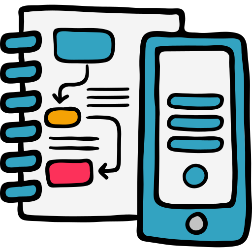

  

This module is all about interacting with **interfaces**, and how interaction design, gaphics, and user-experience design come together to provide working applications.

A major part of your job as a designer for screens (like web and apps) is interation and prototyping. Prototyping is incredibly important because it allows designer-client communication before software development (an expensive and potentially lengthy process should things need changing). Prototypes aren't 100% functional. Rather the give an overview of the upcoming experience by highlighting the graphical interface and how the design flows for the needs of the product.

<!--

  

    

    
      <i class="fas fa-certificate"></i>
      Coming Soon!
    
    

  

  

    Sorry, we're not ready to move on yet.
  

-->
